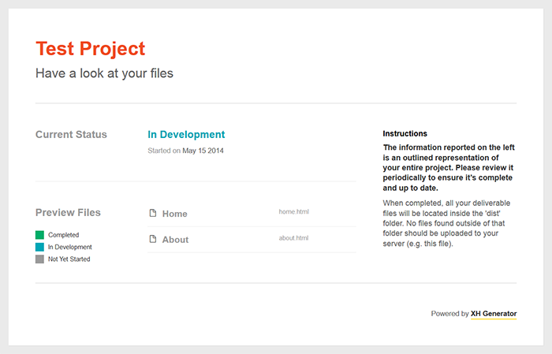
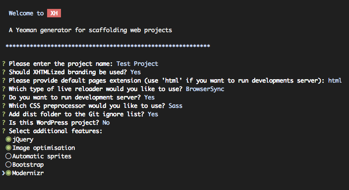
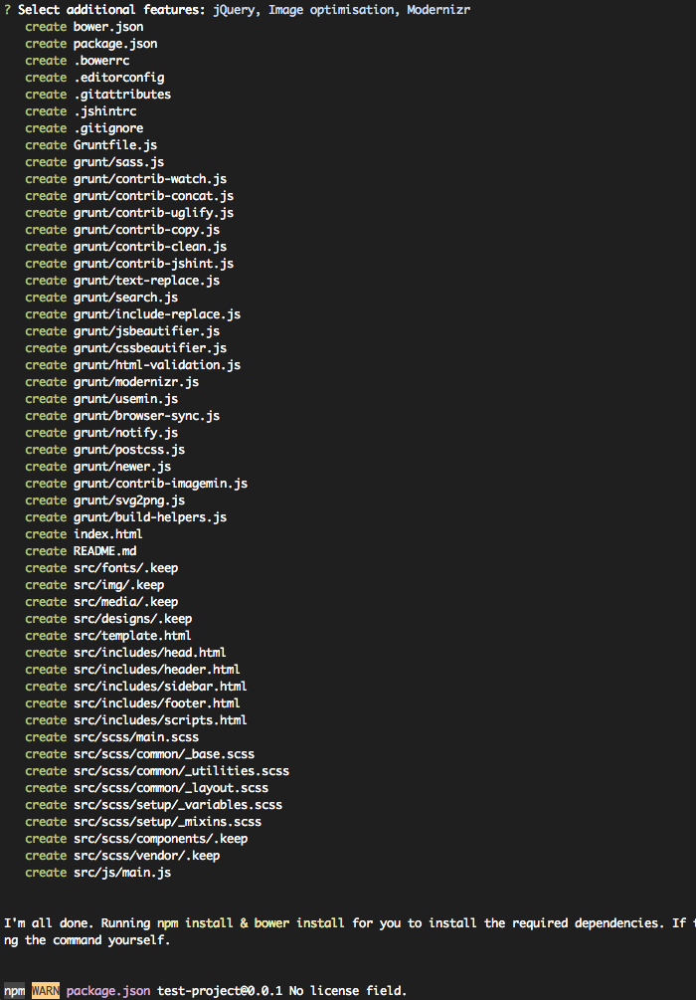
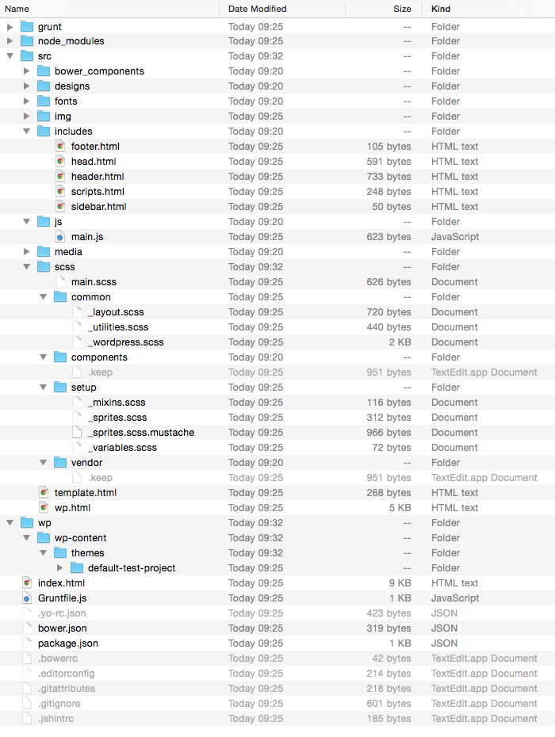
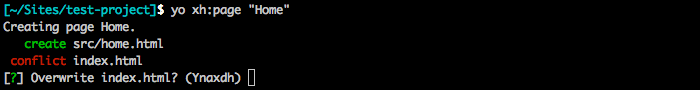
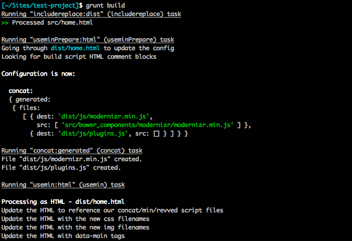
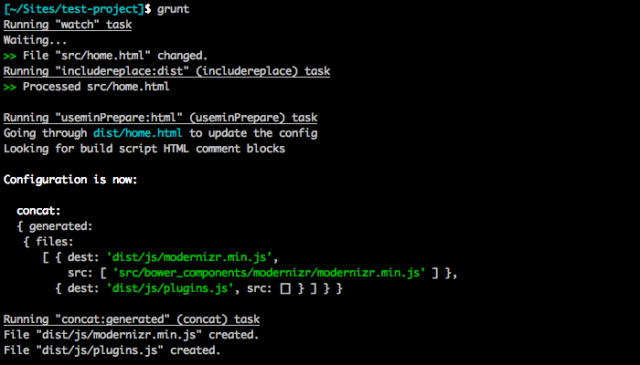

XH Generator [](https://travis-ci.org/xhtmlized/generator-xh) [](http://badge.fury.io/js/generator-xh)
============

XH Generator is a [Yeoman](http://yeoman.io) generator for scaffolding web projects. XH is suitable for client work when you deliver a completed project to your client for further review and development.

XH Generator creates a project structure, files and Grunt tasks which support modern workflows like CSS preprocessors. Built HTML, CSS and JS files are prettified and fully editable so clients can work directly with them if they wish.



## Table of contents

- [Features](#features)
- [Prerequisites](#prerequisites)
 - [Node.js](#1-nodejs)
 - [Sass](#2-sass)
 - [Grunt](#3-grunt)
 - [Bower](#4-bower)
 - [Yeoman](#5-yeoman)
 - [XH Generator](#6-xh-generator)
- [Usage](#usage)
 - [Project scaffolding](#1-project-scaffolding)
 - [Project structure](#2-project-structure)
 - [Adding pages to the project](#3-adding-pages-to-the-project)
 - [Development](#4-development)
 - [WordPress Development](#5-wordpress-development)
 - [Collaborating](#6-collaborating)
- [Tips & Tricks](#tips--tricks)
 - [Working with files in the dist folder](#working-with-files-in-the-dist-folder)
 - [Writing styles](#writing-styles)
 - [Adding 3rd party dependency via Bower](#adding-3rd-party-dependency-via-bower)
- [Changelog](#changelog)
- [Contributing](#contributing)
- [Credits](#credits)
- [License](#license)

## Features
- Custom project name
- Responsive project index with a list of pages / templates
- [HTML includes](https://github.com/alanshaw/grunt-include-replace) to avoid code duplication
- A sub generator for adding pages to the project
- Industry standard [normalize.css](http://necolas.github.io/normalize.css/) as a base stylesheet
- CSS Preprocessing with [SCSS](http://http://sass-lang.com/) or [Less](http://lesscss.org/)
- Optional libraries like [Bootstrap](http://getbootstrap.com/), [Modernizr](http://modernizr.com/) & [CSS3 Pie](http://css3pie.com/)
- Add vendor-prefixed CSS properties with [autoprefixer](https://github.com/nDmitry/grunt-autoprefixer)
- Grunt tasks for prettifying built HTML / CSS / JS
- Auto generated table of contents in main.css
- Functionality for merging JS libraries to reduce number of HTTP requests
- Consistent coding style supported by [.editorconfig](http://editorconfig.org/)
- JavaScript code linting with [JSHint](http://www.jshint.com/)
- Optional [WordPress styles](http://codex.wordpress.org/CSS) for images and captions
- WordPress development support

## Prerequisites

The following software needs to be installed if you want to use XH Generator. These installations need to be done just once so you can skip this section if you have the software already installed.

(Note: As a command line replacement at Windows we recommend [ConEmu](https://code.google.com/p/conemu-maximus5/).)

### 1) Node.js

Install [Node.js](http://nodejs.org/) so you can work with `npm`, Node package manager.

### 2) Sass
If you want to use SCSS for CSS preprocessing (SCSS is a default option), you will need to install [Ruby](https://www.ruby-lang.org/en/installation/) and [Sass](http://sass-lang.com/install). Once Ruby is installed (on Mac it comes preinstalled), install the Sass preprocessor from the command line.

```
gem install sass
```

### 3) Grunt
Then install [Grunt](http://gruntjs.com/)'s command line interface (CLI) globally:

```
npm install -g grunt-cli
```

### 4) Bower
For managing certain dependencies like Bootstrap, you will need [Bower](http://bower.io/), another package manager. Install it from the command line too:

```
npm install -g bower
```

Also make sure that [git](http://git-scm.com/) is installed as some bower packages require it to be fetched and installed. On Windows ensure that Git is installed in your PATH by selecting *Run Git from the Windows Command Prompt* option during installation (check this [screenshot](http://wiki.team-mediaportal.com/@api/deki/files/3808/=Git_Setup_-_Run_from_Windows_Command_Prompt.PNG)).

### 5) Yeoman
XH Generator is a [Yeoman](http://yeoman.io/) generator, so obviously it depends on it. You can easily install Yeoman with the following command:

```
npm install -g yo
```

### 6) XH Generator
Finally install the XH Generator:

```
npm install -g generator-xh
```

Congratulations, you are now ready to use XH Generator!

## Usage

### 1) Project scaffolding

To create a project with XH Generator, create a new folder, open a command line in it and type:

```
yo xh
```

You will be presented with a welcome screen and project scaffolding options. Answer the generator questions according your project needs.



Once done, the generator will create the required files and folders and install all npm and Bower dependencies for you:



### 2) Project structure

The generated project structure will look like this:



The meaning of files and folders are as follows:

- **dist** - production / preview files are automatically generated here, this is where you check your work in a browser.
- **node_modules** - Node.js modules for various Grunt tasks, usually you don’t have to do anything about this folder
- **src** - source files, development is done here
 - **bower_components** - 3rd party libraries managed via [Bower](http://bower.io/)
 - **includes** - HTML partials like `head.html`, `scripts.html`, etc.
 - **scss / less** - SCSS or Less files
    - `main.scss` / `main.less` - main file where other stylesheets are imported
    - `_variables.scss` / `variables.less` - variables file
    - `_mixins.scss` / `mixins.less` - mixins file
    - `_common.scss` / `common.less` - common styles with some minimal default styling
    - `_wp.scss` / `wp.less` -  [WordPress styles](http://codex.wordpress.org/CSS) for images and captions (in WP projects)
 - **js**
    - `main.js` is a main JS file in project
 - `home.html`, etc. - HTML files composed from HTML partials
- `index.html` - project index with project pages listed
- `Gruntfile.js` - [Grunt](http://gruntjs.com/) file with various automation tasks defined in it
- `bower.json` - Bower dependencies in the project
- `package.json` - npm packages dependencies
- `.yo-rc.json` - Yeoman generator configuration file
- `.bowerrc` - configuration file for Bower
- `.editorconfig` - [EditorConfig](http://editorconfig.org/) configuration file to achieve consistent coding style
- `.gitattributes` - [Git](http://git-scm.com/) configuration file to force Unix line ending in all text files
- `.gitignore` - default Git ignore files and folders
- `.jshitrc` - [JSHint](http://www.jshint.com/) configuration


On a typical project, you will work in `src` folder and check your work in `dist` folder so you don’t have to touch other files.

### 3) Adding pages to the project

Once you have basic project structure generated, you should add pages you will be working on. XH Generator comes with a subgenerator for adding new pages to the project.

From the command line type:

```
yo xh:page “Page Name”
```

for example

```
yo xh:page “Home”
```

You can also create multiple pages at once by separating page names with space:

```
yo xh:page “Home” “About Us” “Contact Us” “News”
```

The command will do the following:

1. creates a HTML file for your page in `src` folder from the template file `src/template.html`. If you want you can update the template file as needed, so the generated files look accordingly.
2. adds a page name and link to it to the project index
3. runs `grunt build` command to generate the page


When running the command, you will asked if `index.html` should be overridden:



If you wonder what Yanxdh means in the above screenshot, it is:
- **Y:** Yes (Default)
- **n:** No
- **a:** Yes to this question and all others.
- **x:** Abort
- **d:** Show the differences between the old and the new file
- **h:** Help, list all options

Confirm overwriting the file with `Y` or with `a` at once.

### 4) Development

When you have the basic setup done and your first page added, you can start development. Run the grunt build command to generate preview files in the dist folder:

```
grunt build
```



If everything went ok, the preview files will be generated and you will be able to check your work in the `dist` folder. XH Generator doesn't create a server, so you need to preview files on your existing local web server.

To re-compile HTML / SCSS file in real time you can use default task. Type

```
grunt
```

and this will start a task that will watch for changes in files and recompile them as needed. Now you can also connect with a [LiveReload browser extension](http://feedback.livereload.com/knowledgebase/articles/86242-how-do-i-install-and-use-the-browser-extensions) to enable live reloads in your browser.



To rebuild the whole project, use the grunt build task again

```
grunt build
```

To validate HTML files, use the following task

```
grunt validate
```

To detach X-Precise from pages, rebuild the project, validate HTML files and check JavaScript files with JS Hint, use the following task

```
grunt qa
```

### 5) WordPress Development

XH Generator supports WordPress development. When setting up the project using `yo xh`, answer _Yes_ to the question _Is this a WordPress project_?. The generator prepares directory structure for WP installation and connects the front-end files to the project theme.

Use the WordPress subgenerator to set up a WordPress project any time in the project life cycle:

```
yo xh:wp
```

Several options are available:

- database settings which are later inserted into `wp-config.php`
- installation of [WPized Light base theme](https://github.com/xhtmlized/wpized-light).
- installation of [Stream](https://wp-stream.com/) plugin
- installation of [WP Sync DB](https://github.com/wp-sync-db/wp-sync-db) plugin

Once you run the subgenerator, it does the following:

- downloads the latest WP distribution and places it to `wp` folder
- downloads the optional theme and plugins and place them to their respective folders
- sets up `wp-config.php`
- creates a sample `dev-vhost.conf` file which you can use to set up a virtual host

When running Grunt tasks the front-end `dist` files are automatically copied to your theme folder, so you can continue working on the front-end like usually and all updates will be applied to the WordPress site as well.

### 6) Collaborating

If you are joining an existing project which was set up using XH Generator, remember that the project was already generated with `yo xh` command so you don't have to generate it again. Assuming that you have all [prerequisites](#prerequisites) installed, all you need to do is to clone the existing repository and install Bower and npm dependencies.

Let's imagine we have a project called Robot Magic here at the XHTMLized GitHub account. First, we will clone it locally:

```
git clone git@github.com:xhtmlized/robot-magic.git
```

Now change the directory to your newly cloned project:

```
cd robot-magic
```

First, install Bower depedencies:

```
bower install
```

Then install npm dependencies:

```
npm install
```

Now the project is set up and you can continue like described in the [Development](#4-development) section. If there are no pages in the project yet, first you need to [add some pages to it](#3-adding-pages-to-the-project).

## Tips & Tricks

### Working with files in the dist folder

In general, it’s not recommended that you work directly with files in the `dist`. The files in `dist` folder are automatically generated from the source files in `src` folder. However, once you hand over the project to your client, they can work directly with plain HTML and CSS files if they wish.

HTML and CSS files are prettified for consistent formatting and a table of contents from imported SCSS or Less stylesheets is generated at the beginning of `main.css` for better overview.

### Writing styles

XH Generator supports SCSS or Less. Sass syntax is not recommended. The following source files are generated in `src/scss` or `src/less` folders:

- `main.scss` / `main.less` - main file where other stylesheets are imported
- `_variables.scss` / `variables.less` - variables file
- `_mixins.scss` / `mixins.less` - mixins file
- `_common.scss` / `common.less` - some minimal common styling
- `_wp.scss` / `wp.less` -  [WordPress styles](http://codex.wordpress.org/CSS) for images and captions (in WP projects)

The following approach is recommended when creating styles:

1. Use `main.scss` or `main.less` only for importing other stylesheets. Do not write styles directly to these files!
2. Use variables and mixins files to store your variables and mixins.
3. Depending on your preferences for styles organization, you can organize them according modules & components (recommended), or pages.
4. Comment [main sections and subsections](https://github.com/xhtmlized/css-coding-standards#comments) appropriately.
5. If you want to avoid using preprocessors for certain reason (eg. your project is very simple), you can still use SCSS or Less files to write only regular CSS. In such case use Less as it's [faster than Ruby Saas](http://www.solitr.com/blog/2014/01/css-preprocessor-benchmark/).

### Adding 3rd party dependency via Bower

Let’s say you want to add [Colorbox](http://www.jacklmoore.com/colorbox/) to your project. The following example shows how you can add it as a Bower package and merge its JS file into common `plugins.js` file.

1. First, install it via Bower

    ```
    bower install jquery-colorbox --save-dev
    ```

2. Then link it in `src/includes/scripts.html`. This will ensure that the library will be added to `plugins.js` file

    ```html
    <script src="//code.jquery.com/jquery-1.11.1.min.js"></script>
    <script>window.jQuery || document.write('<script src="js/jquery.min.js">\x3C/script>')</script>
    <!-- build:js js/plugins.js -->
    <script src="bower_components/jquery-colorbox/jquery.colorbox-min.js"></script>
    <!-- endbuild -->
    <script src="js/main.js"></script>
```

3. Download [Colorbox archive](https://github.com/jackmoore/colorbox/archive/master.zip) and copy images from `example1/images` folder to `src/img/colorbox` folder.

4. Get `colorbox.css` from the archive, rename it to `colorbox.scss` and store it in `src/scss` folder

5. Import `colorbox.scss` in `main.scss`

    ```css
    @import "colorbox";
    ```

6. Replace all instances of `images/` in `colorbox.scss` with `../img/colorbox/`

7. Run the `grunt build` task or `grunt` task

8. Now you can use Colorbox in your HTML files and initiate it from `src/js/main.js`

## Changelog

Check [Releases](https://github.com/xhtmlized/generator-xh/releases)

## Contributing

If you want to contribute to the XH Generator development, watch the project repository so you are notified about the new issues and related discussion.

Each fix or new idea needs be added as an issue so they can be referred later and reviewed and discussed if necessary.

The following labels are used to mark the issues and ensure predictable generator API and usage:

- **Minor Improvement** - improvement which doesn't significantly affect the way how you work with the generator now.
- **Workflow Change** - will change the way how you work with the generator and projects and you'll probably need to learn or get used to the new stuff. There will be at least 2 weeks interval between creating such issue and starting actual work. During this period you can discuss the issue or submit your objections to the proposed idea.
- **Future Enhancement** - ideas for the future enhancements, they usually won't be implemented sooner than in a couple of weeks or months. If particular future enhancement changes the workflow, such label will be added to it at least 2 weeks before development starts.

Please also follow the GitHub guides for contributing and reporting issues to the project:

- [Contributing to Open Source on GitHub](https://guides.github.com/activities/contributing-to-open-source/)
- [Mastering Issues](http://https://guides.github.com/features/issues/)

## Credits

XH Generator is inspired by [Yeogurt Generator](https://github.com/larsonjj/generator-yeogurt).

## License

XH Generator is licensed under [MIT License](LICENSE).
